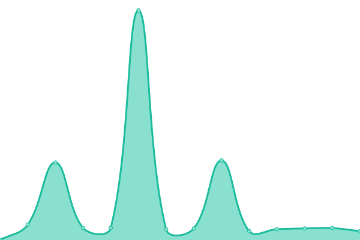

# [📈 Live Status](https://status.inu-cafeteria.app): <!--live status--> **🟧 Partial outage**

This repository contains the open-source uptime monitor and status page for [INU App Center](https://inu-appcenter.firebaseapp.com), powered by [Upptime](https://github.com/upptime/upptime).

With [Upptime](https://upptime.js.org), you can get your own unlimited and free uptime monitor and status page, powered entirely by a GitHub repository. We use [Issues](https://github.com/inu-appcenter/cafeteria-status/issues) as incident reports, [Actions](https://github.com/inu-appcenter/cafeteria-status/actions) as uptime monitors, and [Pages](https://status.inu-cafeteria.app) for the status page.

<!--start: status pages-->
<!-- This summary is generated by Upptime (https://github.com/upptime/upptime) -->
<!-- Do not edit this manually, your changes will be overwritten -->
<!-- prettier-ignore -->
| URL | Status | History | Response Time | Uptime |
| --- | ------ | ------- | ------------- | ------ |
|  [App API](https://api.inu-cafeteria.app) | 🟩 Up | [app-api.yml](https://github.com/inu-appcenter/cafeteria-status/commits/HEAD/history/app-api.yml) | 

 625ms
     
 | 

<a href="https://status.inu-cafeteria.app/history/app-api">99.88%</a>
    

|  [Console API](https://console-api.inu-cafeteria.app) | 🟥 Down | [console-api.yml](https://github.com/inu-appcenter/cafeteria-status/commits/HEAD/history/console-api.yml) | 

 596ms
     
 | 

<a href="https://status.inu-cafeteria.app/history/console-api">99.88%</a>
    

|  [Database](api.inu-cafeteria.app) | 🟩 Up | [database.yml](https://github.com/inu-appcenter/cafeteria-status/commits/HEAD/history/database.yml) | 

 193ms
     
 | 

<a href="https://status.inu-cafeteria.app/history/database">100.00%</a>
    

|  [INU API](http://api.inuappcenter.kr:8080) | 🟥 Down | [inu-api.yml](https://github.com/inu-appcenter/cafeteria-status/commits/HEAD/history/inu-api.yml) | 

 529ms
     
 | 

<a href="https://status.inu-cafeteria.app/history/inu-api">51.64%</a>
    

|  [Console Web](https://console.inu-cafeteria.app) | 🟩 Up | [console-web.yml](https://github.com/inu-appcenter/cafeteria-status/commits/HEAD/history/console-web.yml) | 

 1383ms
     
 | 

<a href="https://status.inu-cafeteria.app/history/console-web">100.00%</a>
    

|  [CodePush](https://codepush.appcenter.ms/v0.1/public/codepush/update_check?deployment_key=Fzqu71x4FXhOaKcAiwpqXkFQddjgYl2dIUW2K&app_version=4.4.1) | 🟩 Up | [code-push.yml](https://github.com/inu-appcenter/cafeteria-status/commits/HEAD/history/code-push.yml) | 

 557ms
     
 | 

<a href="https://status.inu-cafeteria.app/history/code-push">100.00%</a>
    

<!--end: status pages-->

[**Visit our status website →**](https://status.inu-cafeteria.app)

## 📄 License

- Powered by: [Upptime](https://github.com/upptime/upptime)
- Code: [MIT](./LICENSE) © [INU App Center](https://inu-appcenter.firebaseapp.com)
- Data in the `./history` directory: [Open Database License](https://opendatacommons.org/licenses/odbl/1-0/)
